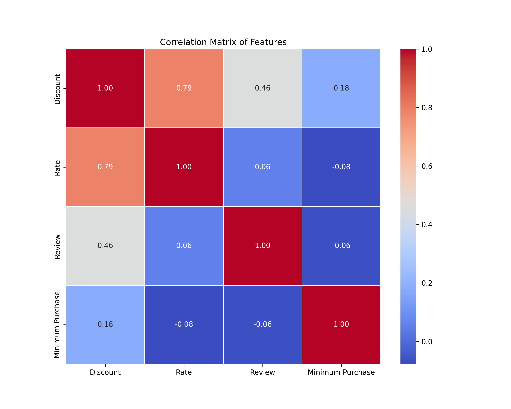
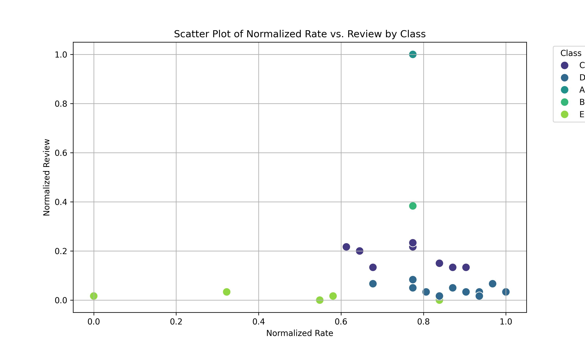

## Data Analyst Task

### Overview
This project tackles a data-driven challenge designed to test the skills relevant to Planning Data Analyst roles, including data analysis, visualization and database management. The task involves working with a dataset of restaurant information from Rafsanjan, performing data cleaning, analysis, creating interactive dashboards, and preparing the data for database storage.

### Data Collection
For this project, data was collected from two primary sources, labeled as "Balad" and "SnappFood". These websites were chosen based on their comprehensive and relevant datasets related to restaurant information in Rafsanjan.

### Data Cleaning
In this section of the project, a variety of statistical methods have been applied to analyze the data collected from Rafsanjan's restaurant scene. All visualizations created during this analysis are available in the 'figure' folder for easy access and review.

Due to the limited amount of data and semantic differences in the definition of outliers, no outlier removal was conducted for this dataset. This decision was made to preserve the integrity of the data and ensure that no valuable information was discarded unnecessarily

### Data Analysis
This section of the project is crucial as it transforms raw data into actionable insights through various analytical techniques and tools. This comprehensive approach to data analysis ensures that the project not only meets but exceeds the objectives set out in the task, providing deep insights and actionable recommendations.

Also Restaurants in this section classified into 5 class.

### Interactive Dashboard
The interactive dashboard is a pivotal component of this project, designed to visually represent the data analysis findings and allow for interactive exploration of the data.

### Database Management
This section can outline the structured approach taken to ensure that the dataset is optimally stored, managed, and accessed in a way that supports the broader goals of your data analysis project.

## How to use
first you should run SnappFoodCrawler.py to collect data from Snappfood.
after that you should run DataProcessing to extract importance of each feature and modeling it.
finally you can run DB.py and save data to dataset.

###### Developer: Amin Khorasani